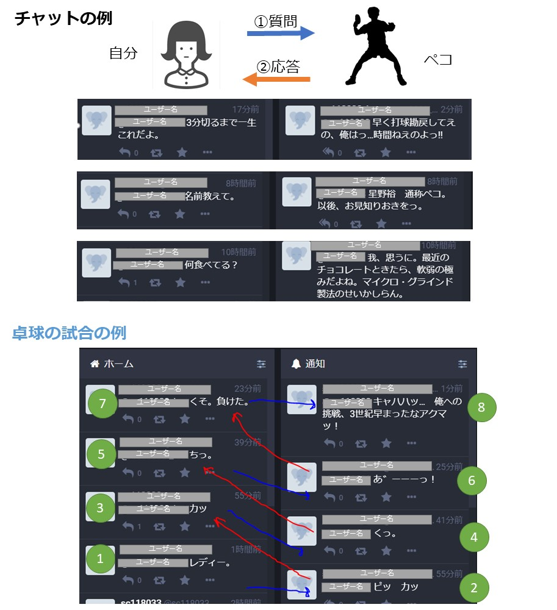

# Chat_Bot

## 作品
ツイートされた内容に対して，漫画「ピンポン」に登場するキャラクター"ペコ"が返答するプログラムを作成しました．

(↑実行中の画面)

## 概要
このプログラムは，つぶやきを得ると，作成した一問一答集からそのつぶやきに近い質問文を見つけ，対応する解答文を返す．

この時，つぶやきと質問文に形態素解析を行って文章をベクトル化し，つぶやきと質問文間の類似度をすべて計算し，
最も類似度が高い質問文に対応する解答文を返している．

形態素解析にJanomeを使用し，文章のベクトル化にDoc2Vecを使用し，類似度はコサイン類似度を使用した．

チャットボットの相手として，漫画「ピンポン」に登場するペコというキャラクターと対話が行えるように，一問一答集を作成した．

参考資料：
- 「Python+Doc2Vecで似た意味を持つ文章を調べる」データサイエンス情報局.2019/10/05.
< https://analysis-navi.com/?p=2293 >(2021/02/10アクセス)
- 「[gensim]Doc2Vecの使い方」Qiita. 2017/12/12.
< https://qiita.com/asian373asian/items/1be1bec7f2297b8326cf >(2021/02/10 アクセス)

## プログラムの構成  
基本的には1~6の流れになっている．

1. 入力(文章)を受け取る
2. 入力文と質問文に形態素解析を行う．(Janome)
3. 文章をベクトル化する(Doc2Vec)
4. 入力文と質問文のコサイン類似度を計算する
5. 類似度の高いものを返す．or 最上位の類似度が低い場合は「わかりません」集からランダムに一つ選ぶ
6. 1~5の操作を入力を受け取るたびに繰り

## プログラムで使用している関数について
- 形態素解析
  - sep_by_janome(text):
    - 入力された文章に対してjanomeによって単語に分割し，分割された単語間にスペースを挟んで連結する．
- 文章をベクトル化
  - model.infer_vector(形態素解析した文章)：
    - 形態素解析で単語に分割された文章をベクトル化する．ベクトル化のモデルに，model = Doc2Vec.load("jawiki.doc2vec.dbow300d.model")の学習済みモデルを使用した．
    - 学習済みモデルは，[使用した学習済みモデル]に出典を示す．
- コサイン類似度を計算
  - np.dot(input_vec, v2) / (np.linalg.norm(input_vec) * np.linalg.norm(v2))...v2は質問文ベクトル：
    - 入力文と各質問文間の類似度を計算．

[使用した学習済みモデル]
- 「日本語WIKIPEDIAで学習したDOC2VECモデル」.OUT-OF THE-BOX.2019/01/22.
< https://yag-ays.github.io/project/pretrained_doc2vec_wikipedia/ >

 
## 作成した一問一答集
漫画「ピンポン」全5巻から，"ペコ"というキャラクターが発言した言葉を抜き出した．全425ペアの一問一答集を作成した．

一問一答集の作成方法として，質問文に誰かが"ペコ"に話しかけた文章を，応答文にそれを受けて"ペコ"が言った文章を登録した．会話になっていないひとりごとのようなものは質問文を「よく分かりません」にし，「わかりません集」として登録した．また，漫画「ピンポン」は卓球漫画ということから，チャットで卓球を行えるように工夫した．「カッ」のような球を打つ擬音語から試合を行うことができる．

## 環境
- ファイル構造
    - src
       - ChatBot_pingpong.py...プログラムを実行．
       - peko.csv...一問一答集
       - jawiki.doc2vec.dbow300d.model...学習済みモデル(文章のベクトル化に使用)

- 実行環境
  - Python 3.8
  - numpy
  - gensim
  - janome
  - csv

- プログラムの動かし方
  - 実行環境を作成
  - 会話のやり取りにMastodonを利用している．Mastodonのアクセストークンを取得するか，Mastodon使用しない場合は入力文の渡し方を変更する．
  - python ChatBot_pingpong.py  を実行

## 実行画面

---

## 補足
- 文章のベクトル化に学習済みモデルを使用しているが，自作の一問一答集でモデルを作成した場合，データが少ないためよい精度を得られなかった．類似度計算で思った結果が得られなかった．
- 使用した学習済みモデルのデータ量が大きいため，容量の確認が必要．また，一つの会話のやり取りにかかる計算時間も1時間ほどかかっている．
- 卓球の試合では，入力文にコントロールが必要．一問一答集を参考．
